# PRÀCTICA: Analitzador de protocols Wireshark

Kali ja té instal·lat Wireshark. Si esteu utilitzant un Ubuntu Desktop, instal·la i configura Wireshark.

Posa en marxa la captura de paquets de Wireshark sobre la targeta de xarxa del teu Kali amb adaptador pont:

    - Adreça IP: 192.168.c.x/24 on c és 2 per 2n A i 4 per 2n B i x el teu número de llista.
    - Porta d'enllaç: 192.168.c.254
    - DNS: 8.8.8.8


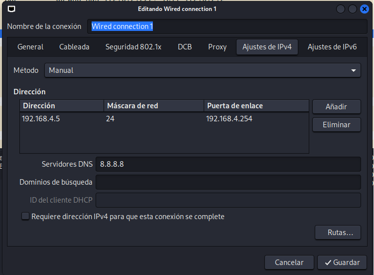

Obrirem una consola i farem un `ping` al router i deixarem que fagi uns quants paquets:

```bash
    ping 192.168.c.254
```

Entrarem a Wireshark i aturarem la captura. A continuació, analitzarem els paquets capturats per identificar informació rellevant.

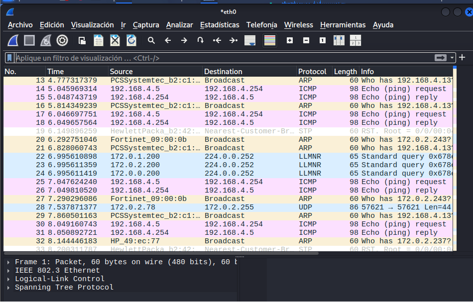

A continuació, posarem en el filtre `icmp` per veure només els paquets ICMP i analitzarem les adreces MAC d'origen i destinació. 

- Quin número de tipus de ICMP té la petició d'eco i quin la resposta d'eco? Com ho veus?.Incorpoar una captura de pantalla on es vegi el tipus de ICMP.

La request te el tipus 8 i la reply el tipus 0. Es pot veure a la columna "Info" de Wireshark on posa "Echo (ping) request" i "Echo (ping) reply".

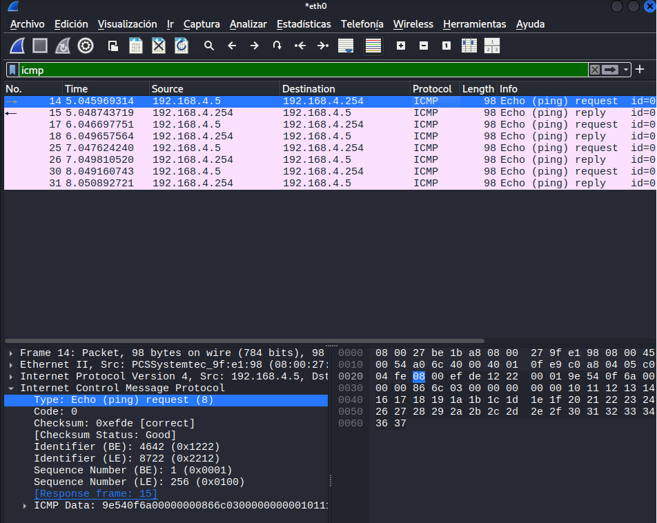

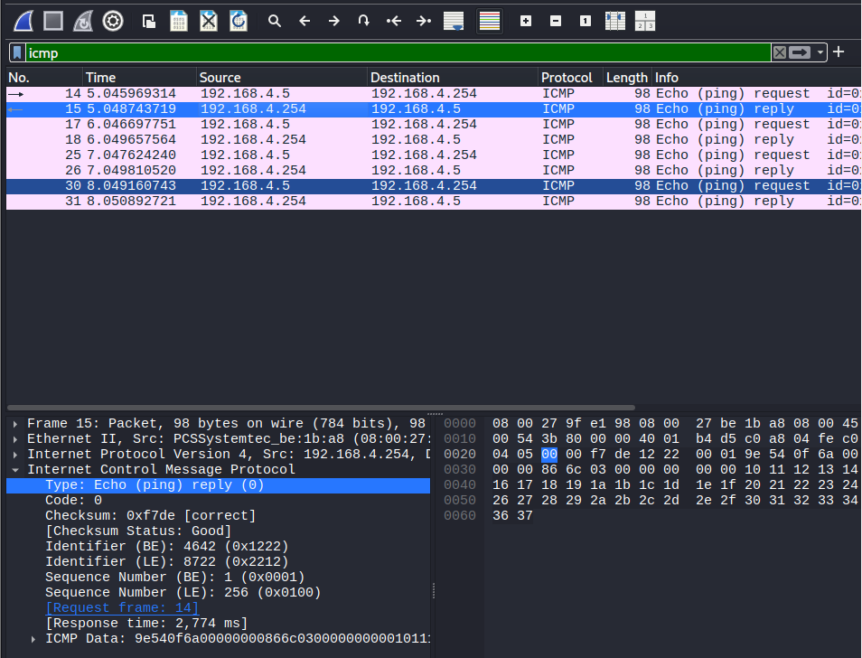

A les opcions avançades de la targeta activem el mode promiscu amb l'opció Permetre-ho tot. Pero en el nostre cas ho farem en la maquina virtual al apartat de Xarxa.

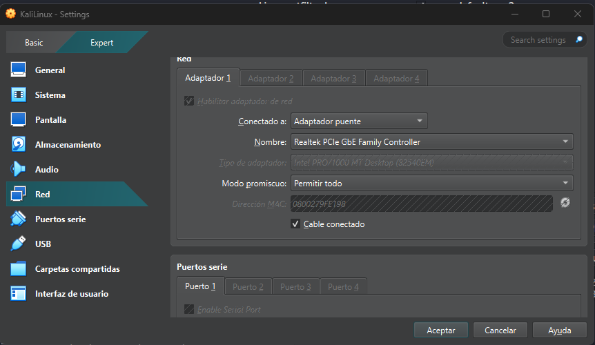

- Fes una captura de trànsit, mentre navegues des de la màquina física. Quin trànsit pots veure relacionat amb el teu PC?


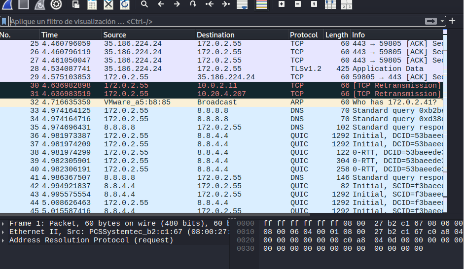

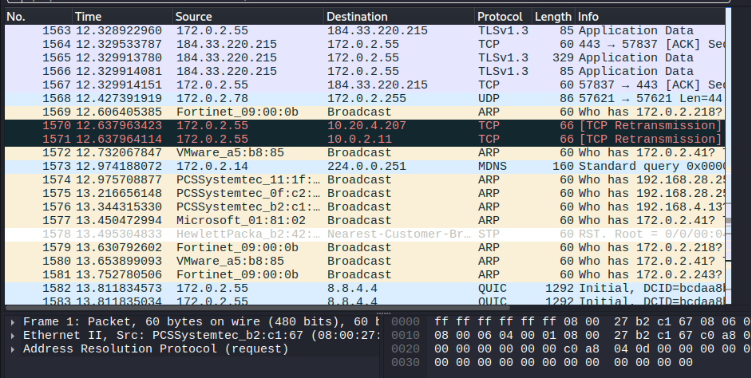

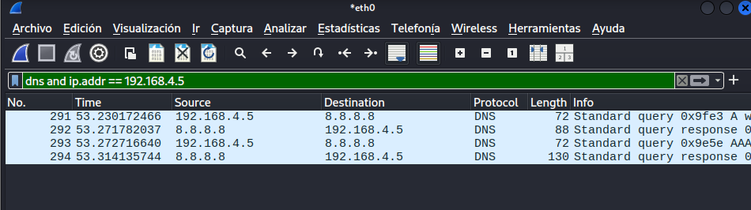

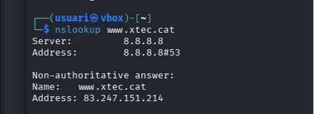

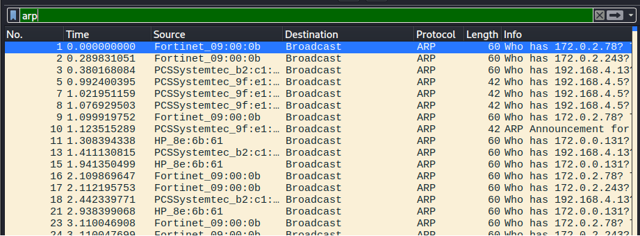

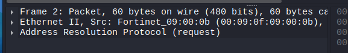


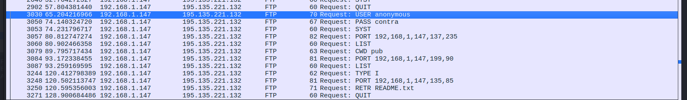

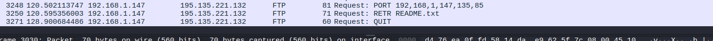

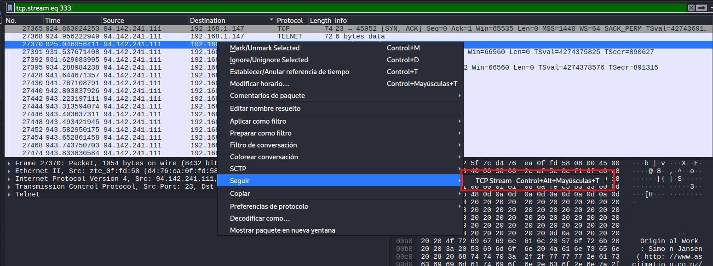

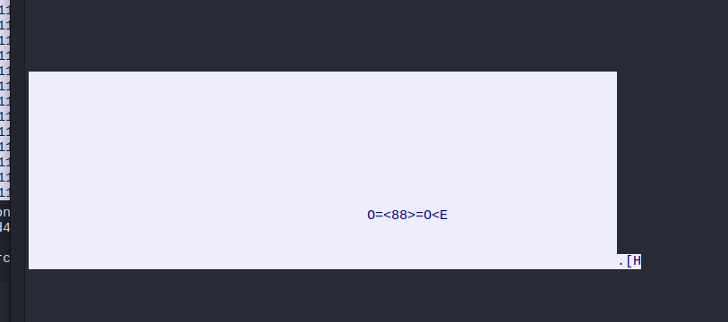

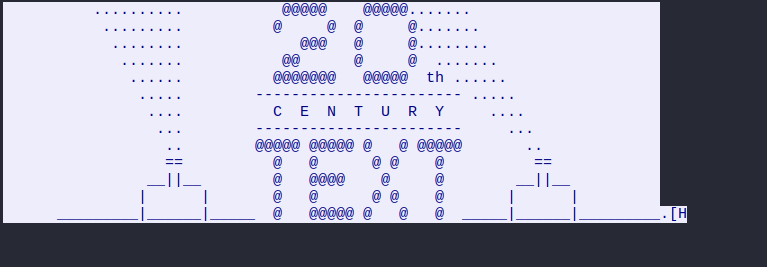

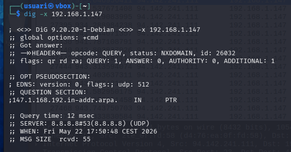

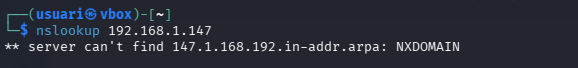

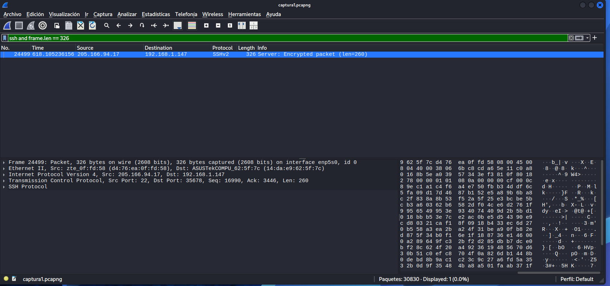

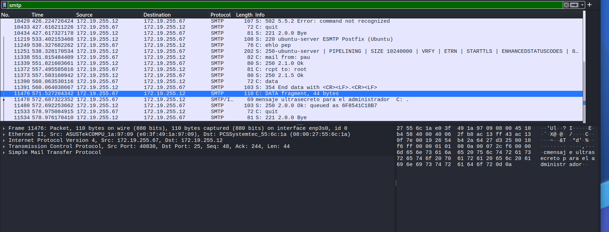

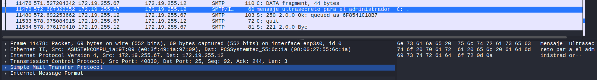
